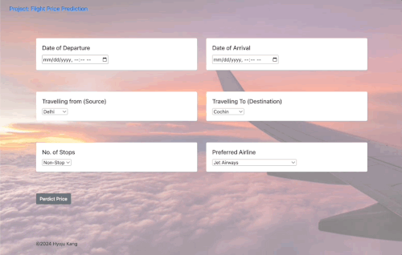

# Flight_Price_Prediction 🛫

## Introduction
In the dynamic domain of air travel, accurately predicting flight prices is crucial for both consumers and companies. This project, leveraging advanced ML techniques, aims to develop an ML model capable of forecasting flight fares with high precision. It is inspired by methods used by leading platforms such as Google Flights and Skyscanner, yet is unique in its approach and implementation.

## Goal

**Objective:** Develop a Machine Learning (ML) model to predict flight ticket prices accurately.

- **Relevance:** This model addresses a classic time-series forecasting problem, providing valuable insights for travelers and businesses in the aviation sector.
- **Benchmarking:** The approach is benchmarked against existing solutions from top flight booking platforms, ensuring competitive performance.

## Project Diagram 📔
Below is a comprehensive diagram illustrating the workflow and architecture of flight price prediction model:

## Live App Demo 👀
Experience the model in action through the live demo:

## Python Libraries Utilized

This project employs a variety of Python libraries, each serving a specific role in data processing and model development:

- **Pandas & Numpy:** For efficient data manipulation and numerical computations.
- **Sklearn:** For implementing and evaluating machine learning models.
- **Matplotlib & Seaborn:** For data visualization and graphical representation of insights.

## Model Accuracy
The following screenshot highlights the accuracy of a predictive model. These metrics are crucial in understanding the performance and reliability of our solution:

## Reference: Skillcate
